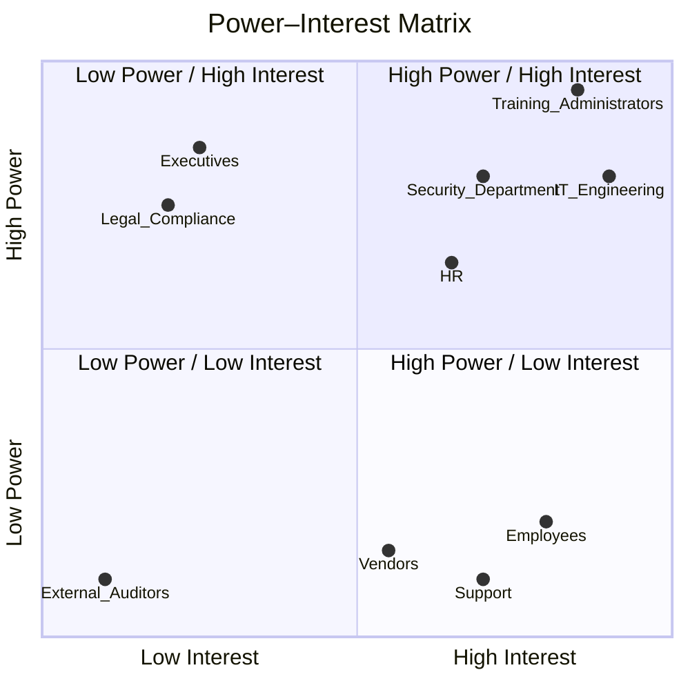

# Homework 1

## 1. Бізнес-драйвери, цілі, SMART-завдання та цінність

### 1.1 Бізнес-драйвери
- Необхідність об’єднати всі типи навчання (внутрішні курси, записи воркшопів, безпекові тренінги, матеріали зовнішніх постачальників) у єдиному середовищі.
- Бажання знизити кількість ручних дій під час погодження заявок і оновлення курсів.
- Потреба в чіткій відповідності комплаєнсу та фіксації проходження обов’язкових тренінгів.
- Стандартизація доступу до системи через SSO для зменшення проблем з автентифікацією.
- Необхідність структурованої взаємодії з навчальними провайдерами без хаотичних листувань.
- Очікування глибшої аналітики для HR, керівництва та відділу безпеки.

### 1.2 Бізнес-цілі
- Запровадити одну платформу для пошуку курсів, реєстрації, перегляду історії навчання та керування заявками.
- Підвищити узгодженість та прозорість навчального процесу, мінімізувавши рутинні операції.
- Впровадити автоматичну перевірку правил бронювання й пріоритетів, щоб знизити частоту помилок.
- Забезпечити своєчасну доставку нотифікацій для всіх типів змін у системі.
- Дати можливість зовнішнім постачальникам самостійно підтримувати актуальність своїх пропозицій.
- Створити інфраструктуру, яка може масштабуватися без значних простоїв.

### 1.3 SMART-завдання
- Зменшити кількість ручних дій адміністраторів мінімум на **50% протягом 6 місяців**.
- Вийти на **97% точності** у повторній валідації курсів після оновлень.
- Забезпечити **доступність платформи 99.3%**, враховуючи інтеграції.
- Скоротити час пошуку та бронювання курсу до **не більше 60 секунд**.
- Зменшити затримку між оновленням курсу та його публікацією в системі для провайдерів до **1 робочого дня**.
- Досягти того, щоб **85% нотифікацій** доставлялись менш ніж за **45 секунд**.

### 1.4 Бізнес-цінності
- Прозорість роботи з курсами та заявками.
- Можливість контролю прогресу навчання кожного співробітника.
- Менші операційні витрати завдяки автоматизації.
- Покращена взаємодія між компанією та зовнішніми постачальниками.
- Використання даних і метрик як основи для подальших рішень.

---

## 2. Ідентифікація стейкхолдерів

| Група | Роль / Інтерес | Основні відповідальності | Потрібні матеріали |
|-------|----------------|---------------------------|---------------------|
| Співробітники / Учні | Проходження курсів | Пошук, запис, перегляд історії | Інтерфейс, інструкції |
| HR | Аналіз і контроль навчання | Звіти, моніторинг статусів | Дашборди, експорт даних |
| Адміністратори курсів | Управління змінами | Створення, редагування, перевірка заявок | Процесні діаграми, admin-UI |
| Підрозділ безпеки | Вимоги SSO та доступів | Політики доступу, контроль обов’язкових курсів | RBAC-моделі, правила доступу |
| IT / Engineering | Платформа та інтеграції | SSO, API, стабільність | Архітектура, API-спеки |
| Зовнішні провайдери | Додавання курсів | Управління своїми можливостями | Vendor-UI, API-гайди |
| Керівництво | Оцінка ефективності | KPI, стратегічні рішення | Аналітика, узагальнені звіти |
| Юридичний / Compliance | Контроль регуляторних норм | Перевірка роботи з даними | GDPR-документи, retention |
| Підтримка | Допомога кінцевим користувачам | Вирішення інцидентів і питань | Інструкції, FAQ |

---

## 3. Power–Interest Matrix

## 4. RACI Matrix

| Активність / Роль            | HR    | Admin   | IT      | Security | Vendors | Management | Support | Learners |
| ---------------------------- | ----- | ------- | ------- | -------- | ------- | ---------- | ------- | -------- |
| Створення / оновлення курсів | C     | **R/A** | C       | C        | I       | I          | I       | I        |
| Призначення пріоритетів      | C     | **R/A** | I       | C        | I       | I          | I       | I        |
| Повторна перевалідація       | C     | R       | C       | **A**    | I       | I          | I       | I        |
| Створення заявки             | I     | I       | I       | I        | I       | I          | I       | **R**    |
| Перевірка заявки             | C     | **R/A** | I       | C        | I       | I          | I       | I        |
| Погодження заявки            | C     | **R/A** | I       | C        | I       | I          | I       | I        |
| Нотифікації                  | I     | C       | **R**   | C        | I       | I          | I       | I        |
| Дії постачальників           | I     | C       | I       | I        | **R/A** | I          | I       | I        |
| Пошук курсів                 | I     | C       | R       | C        | I       | I          | I       | **A**    |
| Звіти та аналітика           | **A** | R       | C       | C        | I       | C          | I       | I        |
| SSO та доступи               | I     | I       | **R**   | **A**    | I       | I          | I       | I        |
| Інфраструктура               | I     | I       | **R/A** | C        | I       | I          | I       | I        |
| Підтримка користувачів       | I     | I       | C       | I        | I       | I          | **R/A** | C        |
